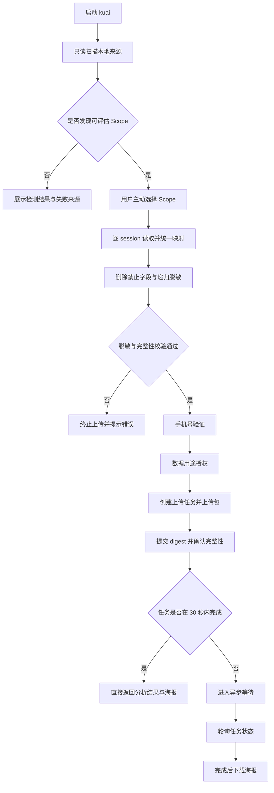

# kuAI 单文件本地客户端技术汇报

> 依据原始设计稿：[kuAI 单文件本地客户端设计](../specs/2026-07-30-kuai-single-binary-local-client-design.md)

## 1. 汇报结论

本次方案的核心目标，是把 kuAI 从“依赖外部 `agentsview` 的本地能力”收敛为一个真正的单文件本地客户端 `kuai`。

最终交付物只保留一个本地可执行文件，负责本地扫描、范围选择、脱敏、手机号验证、数据用途授权、上传、状态轮询和海报下载；所有分析能力继续放在服务端异步链路中完成。这样做的直接收益是：

- 安装和分发更简单，跨平台交付更清晰；
- 本地能力边界更干净，不再依赖外部 `agentsview` 进程或数据库；
- 数据出本机前先完成脱敏和授权，隐私风险更可控；
- 统一的 `Assessment Scope` 让不同来源的 session 可以按规则合并，避免用户手工理解各家格式差异。

## 2. 为什么要改

现状的问题不是“能不能用”，而是“边界太混乱”。

当前方案把本地解析、服务端分析、外部 CLI、数据库、上传和页面流程混在一起，带来几个直接成本：

- 依赖链长，安装和发版复杂；
- 不同来源的 session 格式各自为政，难以统一评估；
- 本地与服务端职责交叉，后续维护容易出现耦合回流；
- 隐私控制分散在多个环节，难以形成一条可审计的数据处理链。

因此，新方案的原则很明确：本地只做“发现、选择、脱敏、上传”，分析留给服务端。

## 3. 方案总览

### 3.1 单文件交付

`kuai` 以原生 Go 可执行文件形式发布，安装器只负责下载、校验并运行这个文件，不再下载或启动 `agentsview`。

### 3.2 本地职责

本地客户端负责以下流程：

1. 只读发现本地 Agent session；
2. 聚合为一个或多个 `Assessment Scope`；
3. 让用户主动选择一个 Scope；
4. 逐 session 读取、规范化和递归脱敏；
5. 完成手机号验证和数据用途授权；
6. 创建上传任务并上传脱敏包；
7. 校验包完整性；
8. 轮询任务状态，超过 30 秒进入异步等待；
9. 完成后直接下载海报图片。

### 3.3 服务端职责

服务端只接收脱敏后的包，负责：

- 身份与授权校验；
- 创建分析任务；
- 异步分析；
- 返回任务状态；
- 提供最终海报下载。

## 4. 核心设计

### 4.1 统一入口：Assessment Scope

把“用户到底要上传哪一组 session”变成唯一明确的选择单位。Scope 支持四种类型：

- `project`
- `workspace`
- `conversation_group`
- `session_collection`

排序优先级固定为：Project → Workspace → Conversation Group → Session Collection。用户不再面对每个产品各自不同的项目语义，而是面对统一的范围模型。

### 4.2 适配器边界

每个来源都通过独立的只读适配器接入。适配器只负责：

- 声明来源能力；
- 发现 session；
- 打开只读流；
- 把来源事件映射为统一事件结构。

适配器不能：

- 修改来源文件；
- 调用来源 CLI；
- 创建或迁移数据库；
- 扫描未声明目录。

这保证了一个来源失败时，不会拖垮其他来源。

### 4.3 统一脱敏链路

所有 session 进入上传包前都要经过同一条固定链路：

只读打开原始 session → 逐行限制大小并解析 → 映射统一事件 → 删除禁止字段 → 工具参数摘要化 → 剔除 `Read` 返回正文 → 递归脱敏 → 校验大小与编码 → canonical serialization → SHA-256 → 验证和授权完成后上传。

这个顺序的价值在于：任何一步失败，都直接 fail closed，不会出现“半脱敏、半上传”的中间状态。

## 5. 对外表现

### 5.1 页面流程

用户看到的流程是：

扫描 → 选择 Assessment Scope → 本地脱敏 → 手机验证 → 数据用途授权 → 上传 → 上传成功 → 分析等待 → 完成

页面上只展示安全名称、类型、Agent 数、session 数和能力摘要，不展示本地绝对路径、原始用户名或 home 目录。

### 5.2 运行体验

- 默认不选中任何 Scope；
- 扫描失败按来源隔离，不影响其他来源；
- 上传成功后立即给出反馈；
- 分析超过 30 秒后进入异步等待；
- 海报入口直接下载图片，不做预览层。

## 6. 关键流程图



## 7. 验收标准

这次重构是否成功，主要看四件事：

- 发布产物是否真的只剩 `kuai`，没有外部 `agentsview` 依赖；
- 本地是否能按来源隔离发现 session，并正确生成 Scope；
- 上传包是否稳定、可复现，并且不泄漏绝对路径、用户名、正文和 secret；
- 服务端模式和 Mock 模式是否都能覆盖验证、授权、上传、任务与海报下载。

## 8. 风险与注意事项

- 纯 Go SQLite 依赖需要严格控制，保证 `CGO_ENABLED=0` 仍可构建；
- 来源适配器众多，但必须坚持“一个来源一个回归契约”，否则后期会回到格式碎片化；
- 隐私脱敏规则不能只靠单元测试的 happy path，必须覆盖 secret、路径、PII、递归嵌套和未知工具；
- 30 秒同步等待是体验关键点，轮询与恢复逻辑要保持稳定。

## 9. 一句话总结

这次改造的本质，是把 kuAI 从“带着外部依赖工作的本地工具”升级为“真正可独立分发、可审计、可脱敏、可恢复的单文件客户端”。

## 10. 已实现范围

已验证、可选择并导出的来源为：

- Claude Code、Codex、Cursor、OpenCode、VS Code Copilot；
- CodeFlicker、MyFlicker、OpenClaw、Hermes Agent；
- WorkBuddy、Kimi CLI/Code、Qwen Code。

TRAE、TRAE Work、Kimi Work、通义灵码、Qoder、Qoder Work、CodeBuddy 等未取得可信格式证据的来源只做显式目录浅检测，状态为 `detected_unsupported`，不扫描正文、不生成可选 Scope。

正式发布不再包含旧 avscore 启动器、外部 CLI 客户端或第二个二进制。兼容能力已经收敛为 `internal/source` 中的纯 Go 只读适配器，`cmd/kuai` 的依赖图不再包含旧客户端包。

## 11. 构建与验收命令

日常验证：

```bash
go test -race ./...
go vet ./...
npm ci --ignore-scripts --no-audit --no-fund
npm test
python3 -m unittest tests.test_docs tests.test_single_binary_contract -v
bash tests/test_kuai_install_sh.sh
bash tests/test_build_kuai_release_sh.sh
git diff --check
```

正式六平台构建：

```bash
KUAI_VERSION=1.0.0 sh ./scripts/build-kuai-release.sh
```

产物包括 macOS、Linux、Windows 的 `amd64` 与 `arm64` 版本，全部使用 `CGO_ENABLED=0`，并生成 `SHA256SUMS`。可用以下命令检查单个产物：

```bash
go version -m ./dist/kuai-darwin-arm64
```
